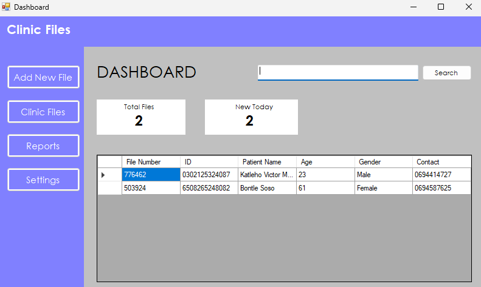
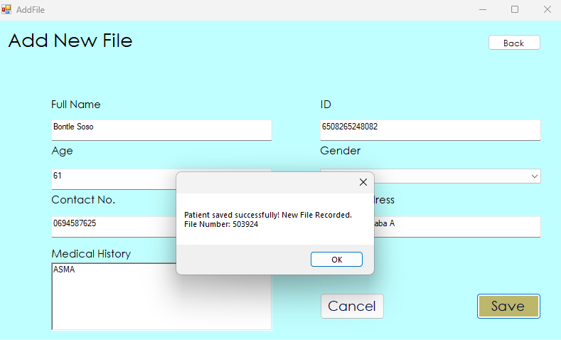

# Clinic File Storage System

A digital patient file management system built with C# and Windows Forms.  
This project replaces manual filing in clinics with a clean, easy-to-use dashboard, patient search, and file tracking.

---

## Features

- Add new patient files with unique 6-digit file numbers
- View all patients in a clean DataGridView dashboard
- Search patients by File Number or Name
- Track total files and new files added today
- Save and load patient data using JSON storage
- Fully digital system with modern UI for clinics

---
## Screenshots





## Installation

### Requirements

- Windows 10/11
- Visual Studio 2019 or later
- .NET Framework 4.7.2 or 4.8

### Steps

1. Clone this repository:
   ```bash
   git clone https://github.com/KatlehoVictorMolangeni/ClinicFileStorage.git
